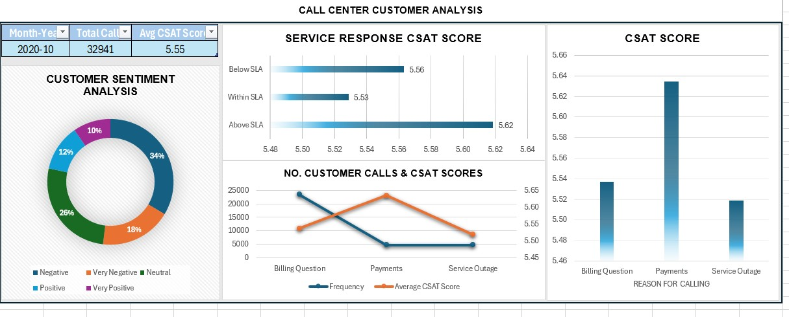

# Excel Customer Analysis Project

## Introduction

This project leverages Excel to perform a comprehensive analysis of customer interactions, focusing on sentiment analysis, root cause analysis, service response times, customer segmentation, and identifying trends and patterns. The goal is to enhance our understanding of customer satisfaction levels, streamline service responses, and tailor services to meet customer needs more effectively.

## Analysis Overview

### Customer Sentiment Analysis

- **Goal**: Perform sentiment analysis on customer interactions to categorize them into positive, negative, and neutral sentiments.
- **Key Findings**: Identification of overall customer satisfaction levels, helping in understanding the impact of service quality on customer perceptions.

### Root Cause Analysis

- **Goal**: Investigate common customer complaints to pinpoint recurring problems.
- **Key Findings**: Insights into the main issues leading to customer dissatisfaction, providing a foundation for proactive problem-solving and future escalation prevention.

### Service Response Time Analysis

- **Goal**: Analyze the response times for customer queries and support requests to assess the efficiency of the customer service team.
- **Key Findings**: Evaluation of current response times, highlighting areas where process optimization can improve service efficiency.

### Customer Segmentation

- **Goal**: Segment customers based on demographics, behavior, and preferences.
- **Key Findings**: Insights into different customer segments' needs and pain points, enabling more tailored services and communication strategies.

### Trends and Patterns Identification

- **Goal**: Identify patterns and trends in customer service data.
- **Key Findings**: Discovery of opportunities for process improvements and innovative service offerings based on customer service trends.

## Visualizations

